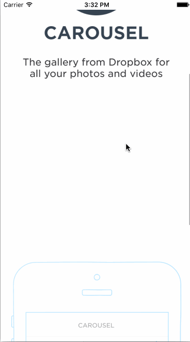

# Carousel

This is a Carousel High Fidelity Prototype application for iOS submitted as the [project 2](https://courses.codepath.com/courses/ios_for_designers/unit/2#!assignment) for CodePath: iOS for Designers.

Time spent: 6 hr

Completed:

* [x] Required: Static photo tiles on the initial screen
* [x] Required: Sign In
* [x] Optional: On appear, scale the form up and fade it in.
* [x] Required: Tutorial Screens
* [x] Optional: User can page between the screens with updated dots
* [x] Optional: Upon reaching the 4th page, hide the dots and show the "Take Carousel for a Spin" button.
* [x] Required: Image Timeline
* [x] Required: Conversations
* [x] Required: Settings

